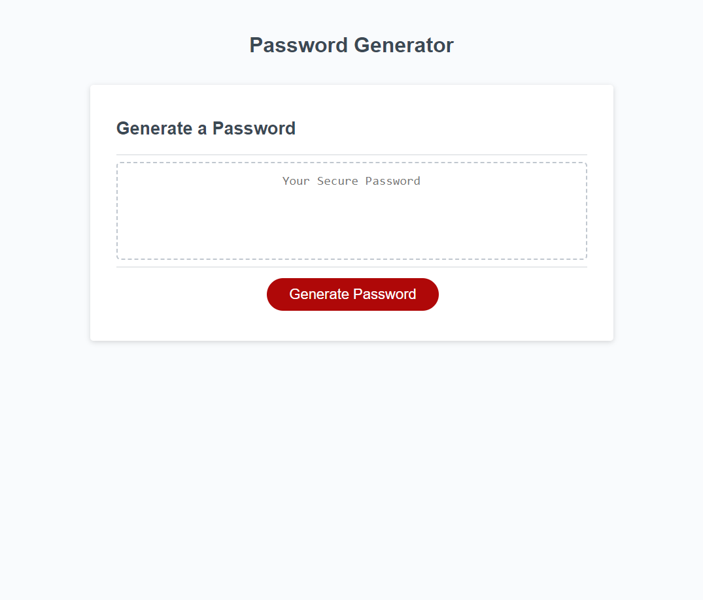

# Password-Generator

## Description
This webpage allows users to generate a random password utilizing a number of user-managed prompts. The page asks the user to select from specified password criteria, and once all prompts are answered, the user is given their randomly generated password in their desired password length. If the user opts out of all password criteria, the page will alert the user to select from at least one criteria in order to generate a password.

## Credit
Thank you to my classmates, Lucas Wysoczanski and Daniel Lee, for partnering with me to work on this challenge. Here are their GitHub profiles--
Lucas Wysoczanski: https://github.com/LucasWyski001
Daniel Lee: https://github.com/drog41813

## Usage

https://github.com/micavilla/password-generator